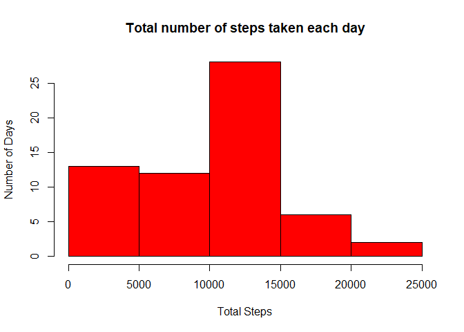
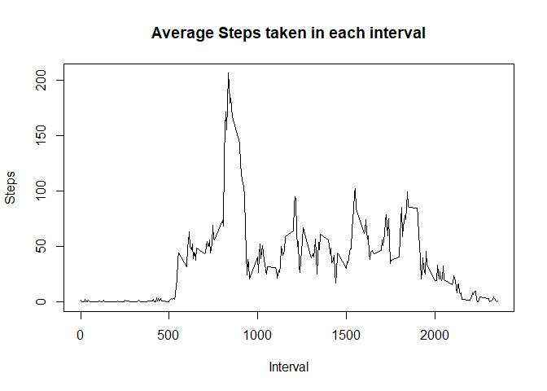
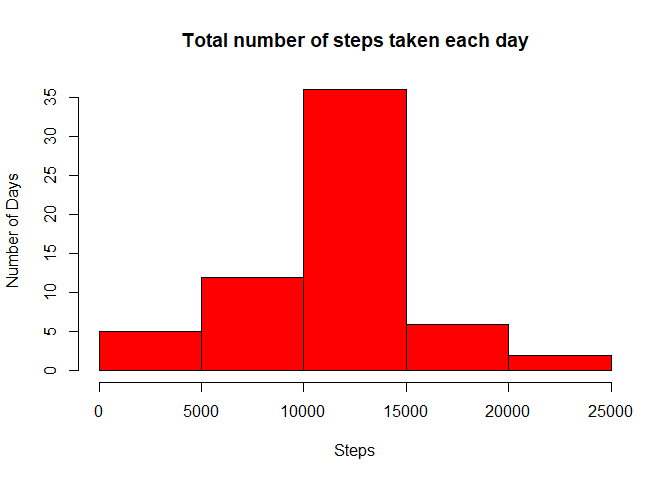
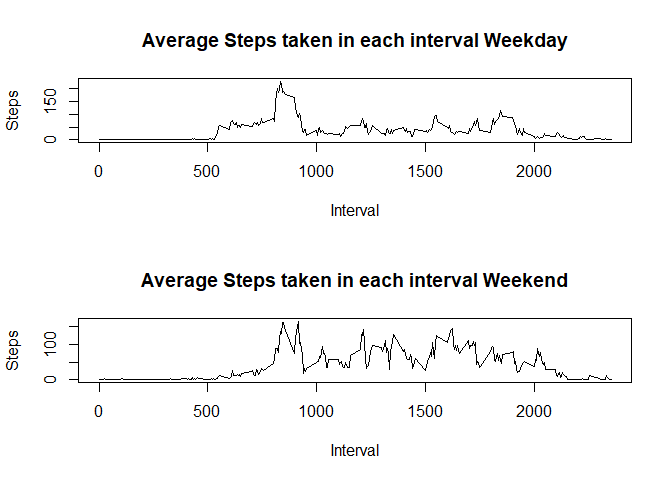

## Loading and preprocessing the data

```r
data <- read.csv(unz("activity.zip", "activity.csv"))
```


## What is mean total number of steps taken per day?

```r
totalSteps <- tapply(data$steps, data$date, sum, na.rm = TRUE)
#Histogram
hist(totalSteps, col = "red", main = "Total number of steps taken each day", xlab = "Total Steps", ylab = "Number of Days")
```

<!-- -->

```r
#Mean
mean(totalSteps)
```

```
## [1] 9354.23
```

```r
#Median
median(totalSteps)
```

```
## [1] 10395
```


## What is the average daily activity pattern?

```r
averageStepsPerInterval <- tapply(data$steps, data$interval, mean, na.rm = TRUE)
plot(x = names(averageStepsPerInterval), y = averageStepsPerInterval, type="l", ylab="Steps", xlab="Interval", main = "Average Steps taken in each interval")
```

<!-- -->

```r
#Max interval 
names(averageStepsPerInterval)[which.max(averageStepsPerInterval)]
```

```
## [1] "835"
```


## Imputing missing 

```r
#Rows with NA
sum(complete.cases(data)==FALSE)
```

```
## [1] 2304
```

```r
#Fill dataset
data2 <- data
data2[!complete.cases(data),1] <- averageStepsPerInterval[as.character(data2[!complete.cases(data),3])]
totalSteps2 <- tapply(data2$steps, data2$date, sum)
#Histogram
hist(totalSteps2, col = "red", main = "Total number of steps taken each day", xlab = "Steps", ylab = "Number of Days")
```

<!-- -->

```r
#Mean
mean(totalSteps2)
```

```
## [1] 10766.19
```

```r
#Median
median(totalSteps2)
```

```
## [1] 10766.19
```


## Are there differences in activity patterns between weekdays and weekends?

```r
day <- weekdays(as.POSIXct(data2[,2]))
weekday <- !grepl("Saturday",day)&!grepl("Sunday",day)
weekend <- grepl("Saturday",day)|grepl("Sunday",day)
data2 <- cbind(data2,weekday,weekend)

averageStepsPerIntervalWeekday <- tapply(data2[data2$weekday == TRUE,]$steps, data2[data2$weekday == TRUE,]$interval, mean)
averageStepsPerIntervalWeekend <- tapply(data2[data2$weekend == TRUE,]$steps, data2[data2$weekend == TRUE,]$interval, mean)
par(mfrow=c(2,1))
plot(x = names(averageStepsPerIntervalWeekday), y = averageStepsPerIntervalWeekday, type="l", ylab="Steps", xlab="Interval", main = "Average Steps taken in each interval Weekday")
plot(x = names(averageStepsPerIntervalWeekend), y = averageStepsPerIntervalWeekend, type="l", ylab="Steps", xlab="Interval", main = "Average Steps taken in each interval Weekend")
```

<!-- -->
